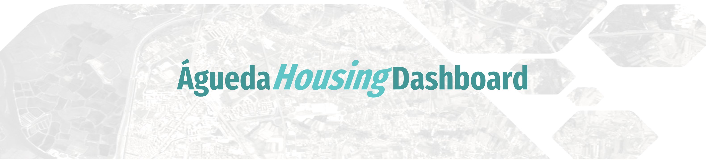

<p align="center"> 
  
</p>


<h3 align ="center">Realizado por: Mafalda Pateo Sousa</h3>
<h6 align="center"> Orientado por: João Lourenço Marques & Paulo Batista</h6>

<h5 align="center"><a href="https://www.ua.pt/pt/getin"> Getin </a> & <a href = "https://www.ua.pt/pt/dcspt"> Departamento de Ciências Sociais, Políticas e do Território </a> - Universidade de Aveiro</h5>

___
___


## **_Descrição_**


<i style= "color: #CBDFDF"> Águeda<i>Housing</i>Dashboard é um dashboard que agrega dados provenientes da Ficha de Áreas do Município de Águeda. 
</i>

<p>Tem como <b style= "color: #29837F">principal objetivo</b> criar uma ferramenta de visualização de dados administrativos de forma a demonstrar a relevância das novas metodologias de recolha de dados, com recurso a Machine Learning na construção e análise de políticas públicas e aconselhamento a privados no âmbito da habitação. </p>

___

## **_Caraterísticas_**

<p>Este código permitirá fazer:

* Leitura e recolha dos dados das Fichas de Áreas com recurso ao OCR
* Tratamento e armazenamento dos dados em Pandas DataFrame
* Criação de gráficos e mapas relevantes para a análise
* Desenho e produção de um dashboard de visualização dos dados com recurso ao PlotlyDash  

___

## **_Instalação_**

<p> Após a instação do Python, proceda à instalação dos dois ambientes que contém todas as bibliotecas necessárias para a utilização do  <i style= "color: #CBDFDF"> Águeda<i>Housing</i>Dashboard </i>, sendo que apenas o ficheiro do <i style= "color: #CBDFDF"> Águeda<i>Housing</i>Dashboard </i>com valores aleatórios necessita do ambiente Tese-dash_aleatorio.yml

```@python
add conda env create -f Tese-dash_aleatorio.yml
  
add conda env create -f Tese_Mestrado_MPS.yml
```
___

## **_Contactos_**

<p> Qualquer questão ou curiosidade, contactem por favor m.pateosousa@ua.pt</p>

___

## **_Reconhecimentos_**

<p align="center"> 
  
</p>
<p>Esta publicação foi produzida no âmbito do projeto DRIVIT-UP (PTDC/GES-URB/31905/2017 – POCI-01-0145-FEDER-031905). O projeto DRIVIT-UP é financiado pela Fundação para a Ciência e Tecnologia com o recurso a fundos do programa Compete2020 do programa Portugal 2020, por sua vez apoiados pelo FEDER – Fundo Europeu de Desenvolvimento Regional.</p>
